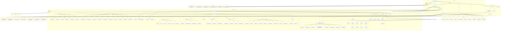

# Struktura Folderów Aplikacji - Salon Beauty Mario (Aktualny Stan)

```mermaid
graph TD
    subgraph "📁 Root Directory"
        ROOT[salon-booking-app/]
        ROOT --> CONFIG[Configuration Files]
        ROOT --> ADMIN[admin-frontend/]
        ROOT --> FUNCTIONS[booking-functions/]
        ROOT --> ARCHIVES[archives/]
        ROOT --> CONTEXT[PROJECT_CONTEXT/]
        ROOT --> PROGRESS[progress/]
    end

    subgraph "⚙️ Configuration Files"
        CONFIG --> GIT[.gitignore]
        CONFIG --> FIREBASE[.firebaserc]
        CONFIG --> FIREBASE_JSON[firebase.json]
        CONFIG --> FIRESTORE_RULES[firestore.rules]
        CONFIG --> FIRESTORE_INDEXES[firestore.indexes.json]
        CONFIG --> PACKAGE[package.json]
        CONFIG --> README[README.md]
        CONFIG --> PRD[PRD.md]
        CONFIG --> RULES[RULES.md]
        CONFIG --> TASK[TASK.md]
    end

    subgraph "🖥️ Admin Frontend Structure"
        ADMIN --> SRC[src/]
        ADMIN --> PUBLIC[public/]
        ADMIN --> CONFIG_ADMIN[next.config.js]
        ADMIN --> CONFIG_TAIL[tailwind.config.ts]
        ADMIN --> CONFIG_TS[tsconfig.json]
        ADMIN --> CONFIG_ES[.eslintrc.json]
        ADMIN --> CONFIG_JEST[jest.config.js]
        ADMIN --> CONFIG_SETUP[jest.setup.js]
        ADMIN --> PACKAGE_ADMIN[package.json]
        
        subgraph "📂 src/"
            SRC --> APP[app/]
            SRC --> COMP[components/]
            SRC --> CTX[contexts/]
            SRC --> HOOKS[hooks/]
            SRC --> LIB[lib/]
            SRC --> TYPES[types/]
            SRC --> UTILS[utils/]
            SRC --> STYLES[styles/]
            SRC --> TESTS[__tests__/]
        end
        
        subgraph "📂 app/"
            APP --> GLOBAL[globals.css]
            APP --> LAYOUT[layout.tsx]
            APP --> PAGE[page.tsx]
            APP --> AUTH[auth/]
            APP --> PROTECTED[protected/]
            
            subgraph "📂 (auth)/"
                AUTH --> LOGIN[login/page.tsx]
            end
            
            subgraph "📂 (protected)/"
                PROTECTED --> LAYOUT_P[layout.tsx]
                PROTECTED --> KALENDARZ[kalendarz/]
                PROTECTED --> KLIENCI[klienci/]
                PROTECTED --> RAPORTY[raporty/]
                PROTECTED --> USLUGI[uslugi/]
                PROTECTED --> USTAWIENIA[ustawienia/]
                
                subgraph "📂 kalendarz/"
                    KALENDARZ --> PAGE_K[page.tsx]
                end
                
                subgraph "📂 klienci/"
                    KLIENCI --> PAGE_CL[page.tsx]
                end
                
                subgraph "📂 raporty/"
                    RAPORTY --> PAGE_R[page.tsx]
                end
                
                subgraph "📂 uslugi/"
                    USLUGI --> PAGE_U[page.tsx]
                end
                
                subgraph "📂 ustawienia/"
                    USTAWIENIA --> BUFORY[bufory/page.tsx]
                    USTAWIENIA --> GODZINY[godziny-pracy/page.tsx]
                    USTAWIENIA --> INTEGRACJE[integracje/page.tsx]
                    USTAWIENIA --> POWIADOMIENIA[powiadomienia/page.tsx]
                    USTAWIENIA --> PROFIL[profil-salonu/page.tsx]
                    USTAWIENIA --> PRYWATNOSC[prywatnosc/page.tsx]
                    USTAWIENIA --> SWIETA[swieta-wyjatki/page.tsx]
                    USTAWIENIA --> ZESPOL[zespol-roles/page.tsx]
                end
            end
        end
        
        subgraph "📂 components/"
            COMP --> AUTH_C[auth/]
            COMP --> CALENDAR[calendar/]
            COMP --> DASHBOARD[dashboard/]
            COMP --> NOTIFICATIONS[notifications/]
            COMP --> REPORTS[reports/]
            COMP --> SETTINGS[settings/]
            COMP --> UI[ui/]
            
            subgraph "📂 auth/"
                AUTH_C --> AUTH_GUARD[AuthGuard.tsx]
                AUTH_C --> LOGIN_FORM[LoginForm.tsx]
            end
            
            subgraph "📂 calendar/"
                CALENDAR --> WEEK_BOARD[WeekBoard.tsx]
                CALENDAR --> DAY_BOARD[DayBoard.tsx]
                CALENDAR --> MONTH_BOARD[MonthBoard.tsx]
                CALENDAR --> DAY_AGENDA[DayAgenda.tsx]
                CALENDAR --> VIEW_SWITCHER[ViewSwitcher.tsx]
                CALENDAR --> CALENDAR_TOOLBAR[CalendarToolbar.tsx]
                CALENDAR --> APPOINTMENT_CARD[AppointmentCard.tsx]
                CALENDAR --> QUICK_EDIT[QuickEdit.tsx]
                CALENDAR --> TIME_ADJUSTMENT[TimeAdjustment.tsx]
            end
            
            subgraph "📂 dashboard/"
                DASHBOARD --> DASHBOARD_LAYOUT[DashboardLayout.tsx]
                DASHBOARD --> CALENDAR_CARD[CalendarCard.tsx]
                DASHBOARD --> STATS_CARD[StatsCard.tsx]
                DASHBOARD --> NOTIFICATIONS_CARD[NotificationsCard.tsx]
            end
            
            subgraph "📂 notifications/"
                NOTIFICATIONS --> NOTIFICATIONS_MODAL[NotificationsModal.tsx]
                NOTIFICATIONS --> NOTIFICATION_ITEM[NotificationItem.tsx]
                NOTIFICATIONS --> NOTIFICATIONS_PROVIDER[NotificationsProvider.tsx]
            end
            
            subgraph "📂 settings/"
                SETTINGS --> SETTINGS_SHELL[SettingsShell.tsx]
                SETTINGS --> SCHEDULE_EDITOR[ScheduleEditorModal.tsx]
                SETTINGS --> WORKING_HOURS[WorkingHoursEditor.tsx]
                SETTINGS --> BUFFERS[BuffersEditor.tsx]
            end
            
            subgraph "📂 ui/"
                UI --> BUTTON[Button.tsx]
                UI --> INPUT[Input.tsx]
                UI --> SELECT[Select.tsx]
                UI --> MODAL[Modal.tsx]
                UI --> CARD[Card.tsx]
                UI --> THEME_TOGGLE[ThemeToggle.tsx]
            end
        end
        
        subgraph "📂 contexts/"
            CTX --> AUTH_CTX[auth-context.ts]
            CTX --> THEME_CTX[theme-context.tsx]
        end
        
        subgraph "📂 hooks/"
            HOOKS --> USE_AUTH[useAuth.ts]
            HOOKS --> USE_PENDING[usePendingTimeChanges.ts]
        end
        
        subgraph "📂 lib/"
            LIB --> APPOINTMENTS_SERVICE[appointments-service.ts]
            LIB --> CUSTOMERS_SERVICE[customers-service.ts]
            LIB --> EMPLOYEES_SERVICE[employees-service.ts]
            LIB --> SERVICES_SERVICE[services-service.ts]
            LIB --> NOTIFICATIONS_SERVICE[notifications-service.ts]
            LIB --> DASHBOARD_SERVICE[dashboard-service.ts]
            LIB --> FILTERS_SERVICE[filters-service.ts]
            LIB --> SETTINGS_DATA[settings-data.ts]
            LIB --> FIREBASE[firebase.ts]
            LIB --> DASHBOARD_DATA[dashboard-data.ts]
            LIB --> DASHBOARD_THEME[dashboard-theme.ts]
        end
        
        subgraph "📂 types/"
            TYPES --> APPOINTMENT_TYPES[appointment.types.ts]
            TYPES --> CUSTOMER_TYPES[customer.types.ts]
            TYPES --> SERVICE_TYPES[service.types.ts]
            TYPES --> EMPLOYEE_TYPES[employee.types.ts]
            TYPES --> NOTIFICATION_TYPES[notification.types.ts]
            TYPES --> SETTINGS_TYPES[settings.types.ts]
        end
    end

    subgraph "☁️ Booking Functions Structure"
        FUNCTIONS --> SRC_F[src/]
        FUNCTIONS --> PACKAGE_F[package.json]
        FUNCTIONS --> CONFIG_TS[tsconfig.json]
        FUNCTIONS --> CONFIG_ES[.eslintrc.js]
        
        subgraph "📂 src/"
            SRC_F --> INDEX_F[index.ts]
            SRC_F --> GOOGLE[google-calendar/]
            
            subgraph "📂 google-calendar/"
                GOOGLE --> AUTH[auth.ts]
                GOOGLE --> CONFIG[config.ts]
                GOOGLE --> SYNC[sync.ts]
                GOOGLE --> TYPES[types.ts]
            end
        end
    end

    subgraph "📁 PROJECT_CONTEXT/"
        CONTEXT --> ARCHITEKTURA[Architektura Wysokiego Poziomu_NEW.md]
        CONTEXT --> KOMPONENTY[Architektura Komponentów Kalendarza_NEW.md]
        CONTEXT --> POWIADOMIENIA[Architektura Systemu Powiadomień_NEW.md]
        CONTEXT --> USTAWIENIA[Architektura Systemu Ustawień_NEW.md]
        CONTEXT --> ARCH[NEW_ARCHITECTURE.md]
        CONTEXT --> PRD[NEW_PRD.md]
        CONTEXT --> PROJECT[NEW_PROJECT_CONTEXT.md]
        CONTEXT --> RULES[NEW_RULES.md]
        CONTEXT --> TASK[NEW_TASK.md]
        CONTEXT --> FLOW[Przepływ Danych w Systemie_NEW.md]
        CONTEXT --> MODEL[Model Danych Firestore_NEW.md]
        CONTEXT --> STRUCTURE[Struktura Folderów Aplikacji_NEW.md]
    end

    subgraph "📁 progress/"
        PROGRESS --> GOOGLE_CALENDAR[2025-10-15-18:36-Google_Calendar_Sync_Fix.log]
        PROGRESS --> CRASH[2025-10-16-16:36-Emergency_Crash_Fix.log]
        PROGRESS --> FIRESTORE[2025-10-16-17:23-Firestore_Realtime_Listeners_Fix.log]
        PROGRESS --> INFINITE[2025-10-16-17:35-Infinite_Loop_Fix.log]
        PROGRESS --> FRONTEND[2025-10-16-18:26-Frontend_Refresh_Fix.log]
    end

    subgraph "📁 archives/"
        ARCHIVES --> ADMIN[admin-frontend-20250928-124521.tar.gz]
        ARCHIVES --> CLIENT[client-frontend-20250928-124723.tar.gz]
    end

    subgraph "📁 public/"
        PUBLIC --> ICONS[icons/]
        PUBLIC --> IMAGES[images/]
        PUBLIC --> FONTS[fonts/]
    end

    %% Połączenia struktury
    ROOT --> CONFIG
    ROOT --> ADMIN
    ROOT --> FUNCTIONS
    ROOT --> ARCHIVES
    ROOT --> CONTEXT
    ROOT --> PROGRESS
    
    CONFIG --> GIT
    CONFIG --> FIREBASE
    CONFIG --> FIREBASE_JSON
    CONFIG --> FIRESTORE_RULES
    CONFIG --> FIRESTORE_INDEXES
    CONFIG --> PACKAGE
    CONFIG --> README
    CONFIG --> PRD
    CONFIG --> RULES
    CONFIG --> TASK
    
    ADMIN --> SRC
    ADMIN --> PUBLIC
    ADMIN --> CONFIG_ADMIN
    ADMIN --> CONFIG_TAIL
    ADMIN --> CONFIG_TS
    ADMIN --> CONFIG_ES
    ADMIN --> CONFIG_JEST
    ADMIN --> CONFIG_SETUP
    ADMIN --> PACKAGE_ADMIN
    
    SRC --> APP
    SRC --> COMP
    SRC --> CTX
    SRC --> HOOKS
    SRC --> LIB
    SRC --> TYPES
    SRC --> UTILS
    SRC --> STYLES
    SRC --> TESTS
    
    APP --> GLOBAL
    APP --> LAYOUT
    APP --> PAGE
    APP --> AUTH_AUTH
    APP --> PROTECTED_PROTECTED
    
    AUTH_AUTH --> LOGIN
    PROTECTED_PROTECTED --> LAYOUT_P
    PROTECTED_PROTECTED --> KALENDARZ
    PROTECTED_PROTECTED --> KLIENCI
    PROTECTED_PROTECTED --> RAPORTY
    PROTECTED_PROTECTED --> USLUGI
    PROTECTED_PROTECTED --> USTAWIENIA
    
    KALENDARZ --> PAGE_K
    KLIENCI --> PAGE_CL
    RAPORTY --> PAGE_R
    USLUGI --> PAGE_U
    USTAWIENIA --> BUFORY
    USTAWIENIA --> GODZINY
    USTAWIENIA --> INTEGRACJE
    USTAWIENIA --> POWIADOMIENIA
    USTAWIENIA --> PROFIL
    USTAWIENIA --> PRYWATNOSC
    USTAWIENIA --> SWIETA
    USTAWIENIA --> ZESPOL
    
    COMP --> AUTH_C
    COMP --> CALENDAR
    COMP --> DASHBOARD
    COMP --> NOTIFICATIONS
    COMP --> REPORTS
    COMP --> SETTINGS
    COMP --> UI
    
    AUTH_C --> AUTH_GUARD
    AUTH_C --> LOGIN_FORM
    CALENDAR --> WEEK_BOARD
    CALENDAR --> DAY_BOARD
    CALENDAR --> MONTH_BOARD
    CALENDAR --> DAY_AGENDA
    CALENDAR --> VIEW_SWITCHER
    CALENDAR --> CALENDAR_TOOLBAR
    CALENDAR --> APPOINTMENT_CARD
    CALENDAR --> QUICK_EDIT
    CALENDAR --> TIME_ADJUSTMENT
    DASHBOARD --> DASHBOARD_LAYOUT
    DASHBOARD --> CALENDAR_CARD
    DASHBOARD --> STATS_CARD
    DASHBOARD --> NOTIFICATIONS_CARD
    NOTIFICATIONS --> NOTIFICATIONS_MODAL
    NOTIFICATIONS --> NOTIFICATION_ITEM
    NOTIFICATIONS --> NOTIFICATIONS_PROVIDER
    SETTINGS --> SETTINGS_SHELL
    SETTINGS --> SCHEDULE_EDITOR
    SETTINGS --> WORKING_HOURS
    SETTINGS --> BUFFERS
    UI --> BUTTON
    UI --> INPUT
    UI --> SELECT
    UI --> MODAL
    UI --> CARD
    UI --> THEME_TOGGLE
    
    CTX --> AUTH_CTX
    CTX --> THEME_CTX
    HOOKS --> USE_AUTH
    HOOKS --> USE_PENDING
    LIB --> APPOINTMENTS_SERVICE
    LIB --> CUSTOMERS_SERVICE
    LIB --> EMPLOYEES_SERVICE
    LIB --> SERVICES_SERVICE
    LIB --> NOTIFICATIONS_SERVICE
    LIB --> DASHBOARD_SERVICE
    LIB --> FILTERS_SERVICE
    LIB --> SETTINGS_DATA
    LIB --> FIREBASE
    LIB --> DASHBOARD_DATA
    LIB --> DASHBOARD_THEME
    TYPES --> APPOINTMENT_TYPES
    TYPES --> CUSTOMER_TYPES
    TYPES --> SERVICE_TYPES
    TYPES --> EMPLOYEE_TYPES
    TYPES --> NOTIFICATION_TYPES
    TYPES --> SETTINGS_TYPES
    
    FUNCTIONS --> SRC_F
    FUNCTIONS --> PACKAGE_F
    FUNCTIONS --> CONFIG_TS
    FUNCTIONS --> CONFIG_ES
    SRC_F --> INDEX_F
    SRC_F --> GOOGLE
    GOOGLE --> AUTH
    GOOGLE --> CONFIG
    GOOGLE --> SYNC
    GOOGLE --> TYPES
    
    CONTEXT --> ARCHITEKTURA
    CONTEXT --> KOMPONENTY
    CONTEXT --> POWIADOMIENIA
    CONTEXT --> USTAWIENIA
    CONTEXT --> ARCH
    CONTEXT --> PRD
    CONTEXT --> PROJECT
    CONTEXT --> RULES
    CONTEXT --> TASK
    CONTEXT --> FLOW
    CONTEXT --> MODEL
    CONTEXT --> STRUCTURE
    
    PROGRESS --> GOOGLE_CALENDAR
    PROGRESS --> CRASH
    PROGRESS --> FIRESTORE
    PROGRESS --> INFINITE
    PROGRESS --> FRONTEND
    
    ARCHIVES --> ADMIN
    ARCHIVES --> CLIENT
    PUBLIC --> ICONS
    PUBLIC --> IMAGES
    PUBLIC --> FONTS

    %% Stylowanie
    classDef root fill:#e3f2fd,stroke:#2196f3,stroke-width:2px
    classDef config fill:#f3e5f5,stroke:#9c27b0,stroke-width:2px
    classDef admin fill:#e8f5e8,stroke:#4caf50,stroke-width:2px
    classDef functions fill:#fff3e0,stroke:#ff9800,stroke-width:2px
    classDef context fill:#e1f5fe,stroke:#03a9f4,stroke-width:2px
    classDef progress fill:#fce4ec,stroke:#e91e63,stroke-width:2px
    classDef archives fill:#f1f8e9,stroke:#689f38,stroke-width:2px
    classDef public fill:#f3e5f5,stroke:#9c27b0,stroke-width:2px
    
    class ROOT root
    class CONFIG config
    class ADMIN admin
    class FUNCTIONS functions
    class CONTEXT context
    class PROGRESS progress
    class ARCHIVES archives
    class PUBLIC public
```

## Podpis
Struktura Folderów Aplikacji_NEW - Aktualny stan z Google Calendar i nowymi komponentami (2025-10-17)